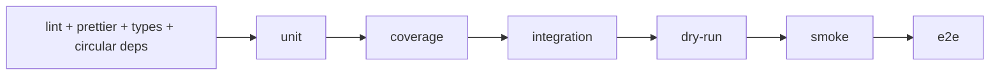

# AboutMe

[](https://github.com/budwol/aboutme.app/actions/workflows/ci.yml)
[](https://creativecommons.org/licenses/by-nc/4.0/)
[](./package.json)
[](./package.json)

AboutMe is my little portfolio app built with plain React and Vite.

Current release: `2.0.0`. The app ships as a static, installable web PWA
built with a plain React + Vite toolchain — no React Native or Expo left
in the runtime or the build.

Clone it, throw in your own data and images, run `npm run init`, and there you go: projects, experience, tech stack, contact stuff, all sitting there like happy little trees on a calm digital canvas. Just a few soft clouds, a couple of brave colors, and your portfolio starts to live.

If you just want the happy path, it is this:

```bash
npm install
npm run init
npm run web
```

That gets you from clone to a running template without wandering through the whole forest first.

## Tech Stack

This thing runs on plain React and Vite. No wizard cave, no enchanted build forest, just a web app with a few happy little layers and enough room to put a mountain where you want one.

### Core

- React 19
- React DOM
- Vite

### Tooling & Quality

- TypeScript
- ESLint
- Prettier
- Husky (Git hooks)
- Jest (ts-jest, jsdom)
- Playwright

## Setup

1. Install dependencies.

   ```bash
   npm install
   ```

   Current baseline is Node `20.19.4` and npm `11.5.2`.

2. Run the initializer.

   ```bash
   npm run init
   ```

   On the first run it creates `.aboutme/`, `.aboutme/app-data.json`, `.aboutme/images/`, and `.env` if `.env.example` exists. It also seeds the default placeholder assets from the repo, so you do not have to paint the first little tree by hand. We start with a little bit of structure, then we can get wild in a controlled way.

3. Fill `.aboutme/app-data.json` with your stuff and replace the placeholder files in `.aboutme/images/` when you are ready.

4. Run the initializer again whenever you change images or other generated runtime assets.

   ```bash
   npm run init
   ```

   The script is idempotent. Run it as often as you want. No mistakes here, just happy little rebuilds. Every pass lays down another calm little layer of paint. It syncs `.aboutme/app-data.json` into the ignored root `app-data.json` and regenerates:
   - `public/images/*`
   - `public/app-data.json`
   - generated logo and favicon assets
   - `public/site.webmanifest`
   - `public/robots.txt`
   - `public/sitemap.xml`
   - `nginx/site.conf`

   If you just want to peek without writing files:

   ```bash
   npm run init -- --dry-run
   ```

   Good for local checks and CI. Same decisions, no writes, just a quiet little rehearsal before the real brush hits the canvas.

5. Start the app.

   ```bash
   npm run web
   ```

   `npm run web` automatically syncs `.aboutme/app-data.json` into `public/app-data.json`, mirrors `.aboutme/images/*` into `public/images/*`, and bumps the web asset version before the dev server starts. Run `npm run init` again when you want all generated runtime artifacts refreshed, such as root `app-data.json`, background/logo derivations, manifests, or nginx config.

## Customize Your Portfolio

If you want this to stop looking like my little template and start looking like your thing, these are the main brushes to grab first:

- `.aboutme/app-data.json`
  this is the heart of the content: profile, projects, links, experience, legal pages
- `.aboutme/images/`
  drop in your avatar, project images, logo, and background here
- `src/i18n/`
  adjust copy and translations if the default wording is not your voice
- `src/components/`
  shape the UI if you want to push the layout further than content swapping
  notable groups are `sections/`, `screens/`, `buttons/`, `cards/`, and `images/`

In practice the usual flow is:

1. run `npm run init`
2. edit `.aboutme/app-data.json`
3. replace files in `.aboutme/images/`
4. refresh `npm run web`
5. run `npm run init` again only when you need regenerated runtime artifacts beyond `public/images`

If you only changed text, structured content, or regular image files inside `.aboutme/images/`, `npm run web` and `npm run export:web` already resync the web copies for you. The extra `npm run init` run is mainly for regenerated background/logo artifacts, manifests, nginx config, and the root `app-data.json` artifact used outside the web fetch path.

## Configuration

Put your source images here:

```
.aboutme/images/
```

The repo already comes with these placeholders:

- `logo.svg`
- `bg.webp`
- `default_avatar.webp`
- `default_project.webp`

Point to the files you want in `.aboutme/app-data.json`, and let the generator do its thing. Maybe it needs a tree. Maybe it needs a mountain. Maybe it just needs your face in `default_avatar.webp`.

### Local Environment

If you need a local `.env`:

```bash
cp .env.example .env
```

`npm run init` already creates `.env` when `.env.example` exists and `.env` is still missing.

`.aboutme/app-data.json` and `.aboutme/images/` are the single source of truth. Everything generated from them, like root `app-data.json`, `public/app-data.json`, public assets, and nginx config, is intentionally ignored by Git. Nice and tidy, like cleaning the brushes before the paint dries and giving the canvas one last friendly nod.

### Navigation & Content

Right now the app gives you a nice little set of pages. Nothing overcooked, just enough room for a tree here, a cloud there, and your work in the middle:

- a localized home page
- project list and detail pages
- experience page
- dedicated contact page
- menu/legal pages (imprint, privacy, terms, licenses)

Navigation is a small hand-rolled client-side router living under `src/navigation/router/`, matching the current URL against a route table and rendering the right screen — no file-based routing convention to keep in sync with the URL structure. Reusable navigation UI lives alongside it under `src/navigation/`.

### Recommended Image Ratios

**Project images** use a 2:1 ratio. The app picks between three sizes depending on viewport width:

| Field in `app-data.json` | Size     | Viewport   |
| ------------------------ | -------- | ---------- |
| `imageL`                 | 1024×512 | > 960 px   |
| `imageM`                 | 512×256  | 480–960 px |
| `imageS`                 | 300×150  | < 480 px   |

Start with a source image of at least ~2000×1000 px at 2:1, then generate the three variants:

```bash
convert source.png -resize 1024x512! images/myproject_1024_512.webp
convert source.png -resize 512x256!  images/myproject_512_256.webp
convert source.png -resize 300x150!  images/myproject_300_150.webp
```

Drop the results into `.aboutme/images/` and point the three fields in `app-data.json` at them. If you do not have an image yet, `default_project.webp` works fine as a placeholder for all three.

## Deployment

If you are just using this as a portfolio template, you can ignore Docker for a while. The normal path is:

- `npm run web` for local work
- `npm run export:web` when you want a static build
- `npm run deploy:local` if you want to copy that build onto a box you control

Both `npm run web` and `npm run export:web` sync `.aboutme/app-data.json` into `public/app-data.json`, mirror `.aboutme/images/*` into `public/images/*`, and bump the web asset version first, so the web app always starts from the latest source content and image files.

They also generate a condensed portfolio PDF from the same `.aboutme/app-data.json` — `public/{Name}_-_Portfolio_DE.pdf` (German) and `public/{Name}_-_Portfolio_EN.pdf` (English), named after the profile's own name — covering profile, contact, tech stack, and work experience, deliberately leaving out the private side projects. Alongside those, the `_ATS` variants (`public/{Name}_-_Portfolio_DE_ATS.pdf`/`_EN_ATS.pdf`) are a deliberately plain, single-column companion: no sidebar, no photo, skill levels spelled out as text instead of bars — meant to survive an Applicant Tracking System's automated parsing, which the two-column designed version is not well-suited for. The designed PDF links to its own ATS counterpart from its page footer. All four ship in `dist` alongside the rest of the export, and the app links to the designed PDF from the contact footer and from a standalone download button in the navigation drawer's footer. Run `npm run generate:resume-pdf` on its own if you just want to regenerate the PDFs without a full export.

Docker is there for people who actually want that delivery path, not as a rite of passage before the app is allowed to exist.

1. Create a `.env` file if your deploy setup needs one.

   ```bash
   cp .env.example .env
   ```

2. Export the app.

   ```bash
   npm run export:web
   ```

   That writes the production build into `dist`, all neat and dry, like we set it out in the sun for a minute.

3. Deploy locally.

   ```bash
   npm run deploy:local
   ```

   That exports the app to `/var/www/html/`, where it can sit there peacefully and be a website. Sometimes a website just wants a quiet place to be.

4. Build and push the container.

   ```bash
   npm run deploy:web
   ```

   This is the optional path. The container build only includes generated runtime assets and nginx config from the project root. Local source data like `.aboutme/`, `.env`, tests, and dev files stay out of the Docker build context. Nginx serves the app on port `8080` inside the container, just quietly doing its job like a happy little cloud drifting across the top of the scene.

   If you want to inspect the sharp edges first:

   ```bash
   npm run deploy:local -- --dry-run
   npm run deploy:container -- --dry-run
   ```

   And if you want the scripts to stop asking and just do the thing:

   ```bash
   npm run deploy:local -- --yes
   npm run deploy:container -- --yes
   ```

## Runtime Guarantees

The runtime path is meant to stay plain and inspectable, not clever.

- The container serves the exported app with nginx on internal port `8080`.
- The image healthcheck hits `http://127.0.0.1:8080/` with `wget`, so the check and the runtime speak the same language.
- Runtime assets are only the exported `dist` output plus generated nginx config. Source content like `.aboutme/`, `.env`, tests, and other workshop clutter stays out of the image.
- HTML content goes through `sanitize-html` with a small allowlist. That path is meant for trusted portfolio content, but it is no longer hanging off a homegrown regex filter.
- The generated nginx config sets the boring but useful headers: `Content-Security-Policy`, `Strict-Transport-Security`, `X-Content-Type-Options`, `X-Frame-Options`, `Cross-Origin-Opener-Policy`, `Cross-Origin-Embedder-Policy`, `Cross-Origin-Resource-Policy`, `Referrer-Policy`, `Permissions-Policy`, and `X-Robots-Tag`.
- Static assets get long-lived cache headers, while `index.html` stays on `no-cache`, so the app shell can refresh without painting over the whole landscape.
- Production web builds do not publish JavaScript source maps. For bundle analysis, create a temporary export with `npx vite build --sourcemap`, inspect it, and remove it afterward. See [ADR 0021](adr/0021-production-source-maps-are-not-published.md).
- The production SEO restriction is intentional: `noindex, nofollow` remains enabled and must not be removed to improve Lighthouse.
- The migration away from React Native and Expo is complete, in two stages: first to a web-only PWA still running on the Expo/React-Native-Web shell, then off that shell entirely onto plain React and Vite (see git history for `WEB-ONLY-MIGRATION.md` and `PLAIN-REACT-MIGRATION.md`, both removed once their work was done).

## Production Checklist

If you want the short answer to "is this thing still standing right?", this is the little checklist:

- `npm run test:security`
- `npm run test:prettier`
- `npm run lint` (checks `src`, `tests`, and `scripts`; strict unused-symbol checks run through `npm run test:types`)
- `npm run test:types`
- `npm run test:circular`
- `npm run test:unit`
- `npm run test:coverage` (100% statements, branches, functions, and lines)
- `npm run test:integration`
- `npm run test:dry-run`
- `npm run test:smoke`
- `npm run test:e2e`
- `npm run test:deps`
- CI passing on the current branch
- generated `nginx/site.conf` still listening on `8080`
- container healthcheck still hitting `127.0.0.1:8080`

That is not enterprise theater. It is just the small pile of proof I would want before calling the current state production ready for this kind of project.

## Ops Checks

If you want a quick little field check after deploy, these are the three strokes that matter:

1. confirm the generated nginx config still listens on `8080`
2. confirm the container answers on `127.0.0.1:8080`
3. confirm the active healthcheck is the one you think it is

For example:

```bash
docker inspect <container> --format '{{json .Config.Healthcheck}}'
docker exec -it <container> wget -S -O - http://127.0.0.1:8080/
docker exec -it <container> grep -n "listen " /etc/nginx/http.d/default.conf
```

If a deploy goes sideways, the first boring questions are usually the right ones:

- did `npm run init` run before the build?
- does the generated `nginx/site.conf` still say `listen 8080 default_server;`?
- does your compose or proxy config also point at `8080`?
- is the running container actually using the expected healthcheck?

## Security Tradeoffs

This little canvas is hardened in the plain, useful places, but a few corners are still honest tradeoffs. No hidden dragons here, just a couple of sharp palette knives sitting next to the paint.

- `deploy-local.sh` is one of those palette knives. It only works inside `/var/www/*` and refuses `/var/www` itself, but it still replaces the current target contents under `sudo`. That is fine for a small owner-run box. Just not something you want to kick over with your elbow while reaching for a cloud.
- `deploy-container.sh` reads and validates the registry settings from `.env`; `--dry-run` stops there after printing the image ref, while a real run exports the web build before building and pushing an image. That is the right move for this setup, but the non-dry path is still a real shipping button, not a harmless little practice stroke.
- The default local checks stay mostly offline and repeatable. `npm run test:security` covers the repo-specific work here: env parsing, URL and HTML hardening, init generation, dependency tree shape, and dry-run behavior. It is a good steady brush. It is not pretending to be a live advisory feed from the sky.
- There is a small `SECURITY.md` now, so there is at least a clear place to send reports. There is still no grand enterprise advisory machine behind it, and that is fine for this kind of project.
- If you want a live dependency advisory check, run `npm audit` when network access is available. That bit stays manual on purpose, because clean local repeatability won the toss against pretending a network check happened when it did not.

Short version: the app path is meant to stay calm and safe, the deploy scripts are meant to be clear and a little sharp, and the repo does not wear fake enterprise shoulder pads just to look important. Just a few happy little guard rails and enough honesty to leave the rough edges where they really are.

### Quality Checks

Local Git hooks stop at unit level. Integration, dry-run, smoke, and E2E stay out of the hooks and are meant to run in CI or manually when needed.

The quality gates are meant to run in this order:

1. `lint + prettier + types + circular deps`
2. `unit`
3. `coverage`
4. `integration`
5. `dry-run`
6. `smoke`
7. `e2e`

- `npm run lint`
- `npm run test:circular`
- `npm run test:deps`
- `npm run test:dry-run`
- `npm run test:unit`
- `npm run test:coverage`
- `npm run test:security`
- `npm run test:smoke`
- `npm run test:types`
- `npm run test:prettier`
- `npm run test:all`
- `npm run test:e2e`
- `npm run test:e2e:ui`
- `npm run init -- --dry-run`

Coverage is collected for executable TypeScript under `src/`. The 100% lines/branches/statements/functions target is not a claim that every file contains runtime statements: pure type/interface-only files correctly appear as `0/0`. Build scripts under `scripts/` have dedicated Jest tests and are exercised by the full pipeline, but are outside the Istanbul threshold because their CLI entry points and external tool adapters are process-boundary code. Always inspect the per-file report, especially when adding a new build script.

`npm run test:all` is the broad local test stack for `prettier + types + circular deps + unit + coverage + integration + e2e`. `smoke` stays separate on purpose.

The Git hook path is intentionally smaller:

- `npx lint-staged`
- `npm run lint`
- `npm run test:types`
- `npm run test:unit`

There is also a small GitHub Actions CI now. It runs the same gate sequence as separate jobs, so the whole little parade is easier to read when something falls over.



The orchestration lives in [`.github/workflows/ci.yml`](./.github/workflows/ci.yml). Each gate sits in its own reusable workflow file:

- [`.github/workflows/ci-lint-prettier.yml`](./.github/workflows/ci-lint-prettier.yml)
- [`.github/workflows/ci-unit.yml`](./.github/workflows/ci-unit.yml)
- [`.github/workflows/ci-coverage.yml`](./.github/workflows/ci-coverage.yml)
- [`.github/workflows/ci-integration.yml`](./.github/workflows/ci-integration.yml)
- [`.github/workflows/ci-dry-run.yml`](./.github/workflows/ci-dry-run.yml)
- [`.github/workflows/ci-smoke.yml`](./.github/workflows/ci-smoke.yml)
- [`.github/workflows/ci-e2e.yml`](./.github/workflows/ci-e2e.yml)

If you want the full local CI pass:

```bash
npm run ci:local
```

`ci:local` preserves the tracked `package-lock.json`, refreshes the local validation path, runs Prettier, ESLint, TypeScript, unit tests, coverage, integration tests, dry-run, smoke, and E2Es, then syncs the real app data back into `public/app-data.json`. It is the broad local verification path, not a tiny cleanup helper.

The E2E path uses the example dataset on purpose, not your personalized portfolio content. After the E2E run, the real `.aboutme/app-data.json` is synced back into `public/app-data.json`, so deploy and export paths do not accidentally keep the example data around.

## License

**Creative Commons Attribution-NonCommercial 4.0 International (CC BY-NC 4.0)**

See `LICENSE.txt` for more information.

## Contact

**budwol**  
Email: info@nosys-productions.com  
Signal: https://signal.me/#eu/iPbKoW4uezUd1bRX8SHa-col_0NLmjNKI2hVZBdTuhUWyWW1eTlIn5c8YLo-IAKf

Project Link:  
https://github.com/budwol/AboutMe.App
